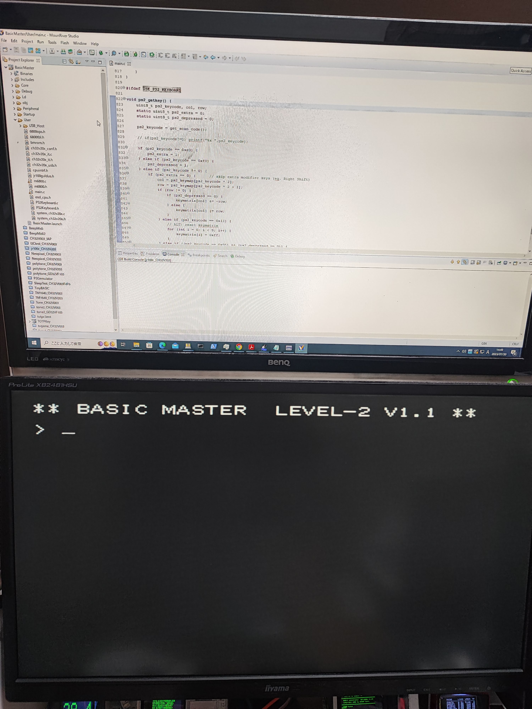

# BasicMaster Jr. エミュレータ for CH32V203

中華マイコン CH32V203 用 BasicMaster Jr. エミュレータです。
以下の機能を実装しています。

- MC6800 CPU
- 16KB RAM
- VRAM (+GVRAM)
- サウンド
- キーボード(PS2 or USB)
- タイマー(たぶん…)

以下の機能は未実装です

- カラーアダプター

メモリ足りないので…

- カセット制御(不安定)

300ボーのみ対応しています。
タイミングによっては、うまくロードできないかもしれません。

特殊キーの配置は以下のようになっています。

- 左 Shift = 英記号
- 左 Ctrl = 英数
- 右 Shift = カナ記号
- 右 Ctrl = カナ
- Backspace = Delete
- ESC = Break

---
bmrom.h に BasicMaster Jr. 実機の ROMが必要です。
bmrom_template.h の該当部分にROMデータをコピーの上、リネームしてください。

- fontrom (2KB)
- basicrom ($B000-$E7FF)
- monrom ($F000-$FFFF)

---
## 解説

ほぼ JR-100 エミュレータと同じです。
接続図もそちらを参考にしてください。 

今回は USB キーボードに対応しています。
USB-OTG を使いますので、PB6/7 を USB の D-/D+ に、VBUS に 5V を供給してください。 

ほぼ公式サンプルの HOST_KM 丸パクリです。
メモリはRAMもFlashもほぼ一杯使っています。
USB対応でメモリ2KBくらい余計に食っていますが、JR-100 と比べて VRAM が 1KB 少なくて何とか収まっています。 

ライブラリの debug.c にある Delay_Ms などの関数がカジュアルに SysTick を書き換えているので、自前で同等の関数を用意しました。
サンプルの HOST_KM 中にも Delay_Ms 多用しているので、困ったものです 

---
## セーブ&ロード

SAVEコマンド(モニタのPコマンド)で USART2 からテキストデータが出力されます。
LOADコマンドを実行するとデータ入力待ちになるので、Teraterm などから保存したテキストを流し込んでください。 
この時送信ディレイを 20ms 以上に設定しないとバッファが溢れます。
セーブ&ロード中は画面が乱れますが、仕様として諦めてください。 
